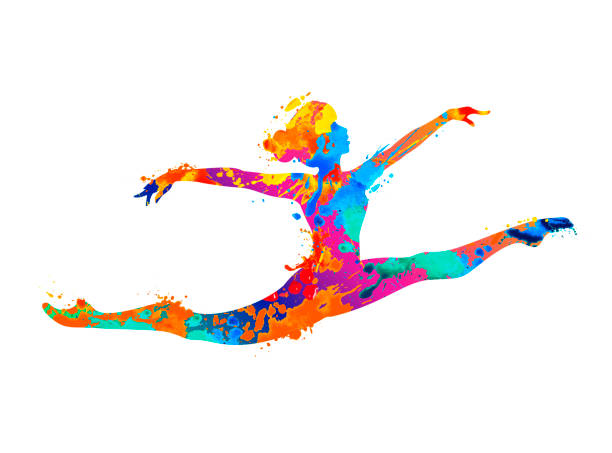

# 🤸‍♂️ Competição de Ginástica Artística 🏆

Esse projeto faz o cadastro de atletas, juntos das da sua pontuação, quando recebida a pontuação ordenamos e depois validamos para tiramos a média de cada atleta. e por fim exibir nome, pontos e média. 

## **Estrutura das Classes** 🧮 🧠

### Class Atleta {

| ATRIBUTOS        | MÉTODOS       | DESCRIÇÃO                        |
| :----------      | :---------    | :--------------------------------|
| `nome, pontos, atlerta[]`   | `adicionarAtleta(atleta), getResume()` | `Classe base onde recebe o nome e pontos, cadastra atleta, e faz um commit com this.nome, this.pontos.`| 

### };

### Class Pontuacao {

| ATRIBUTOS   | MÉTODOS       | DESCRIÇÃO                                   |
| :---------- | :--------- | :------------------------------------------ |
| `super(nome, pontos, atlerta[]) `    | `calcularMedia(), getResultado()` | `Classe que ordena, válida e calcula a média de cada atleta. Faz um commit retornando ATLETA, PONTOS OBTIDOS, MÉDIA VÁLIDA` |

### };

